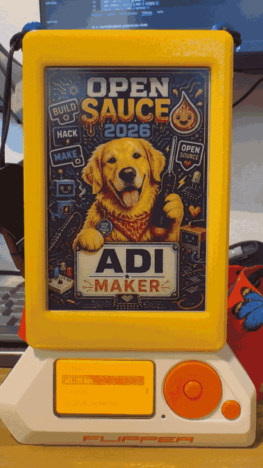
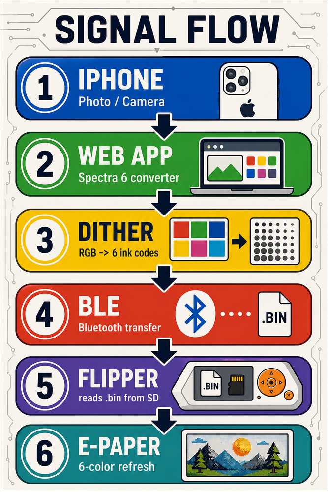
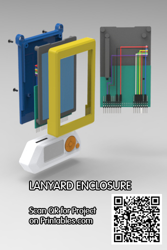
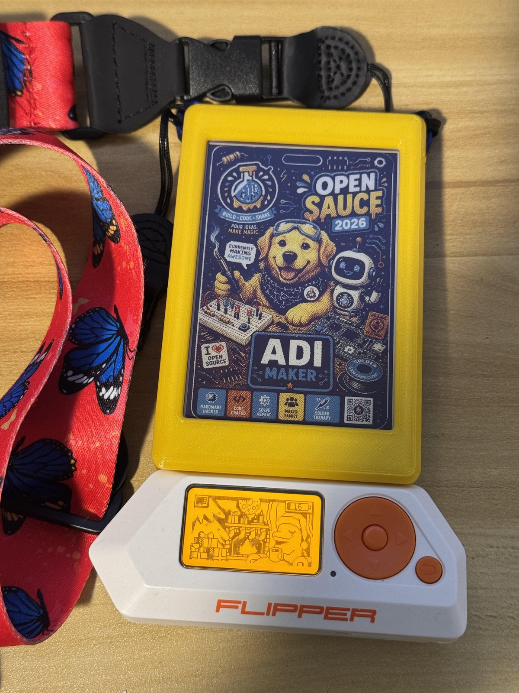
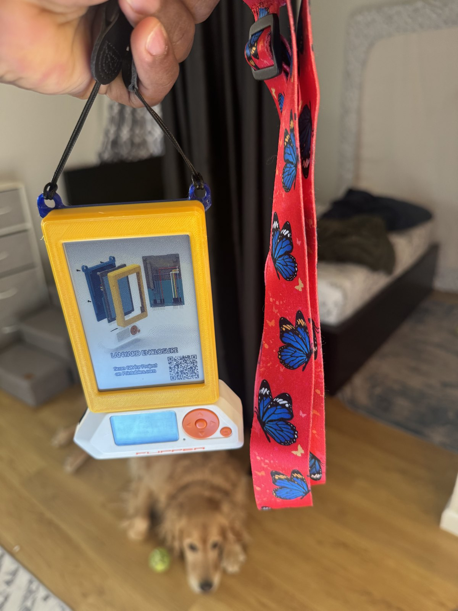

<!--
  This README is the article. It renders on lumosmax.dev as the project
  write-up and works as a Hackster.io submission. Images live in docs/.
-->

# A six-color badge with no computer in the loop

**A Flipper Zero driving a 4 inch Spectra 6 e-paper panel, with a bit-banged
display driver written from the datasheet up. Photos are captured, dithered, and
converted on a phone, sent over BLE, and painted onto e-paper that holds the
image with the panel unpowered. No laptop anywhere in the daily loop.**



*Auto-cycle moving to the next image. Sped up 4x: a real refresh takes about 18
to 20 seconds.*

## The idea

Color e-paper is a great badge material. Readable in daylight, print-like rather
than backlit, and bistable, so the image holds with no power. The friction is
everything upstream: normally you render on a computer, copy the file across, and
drive the panel from a dev board.

The Flipper Zero already has the SD card, the GPIO header, a screen, buttons, and
a BLE link to a phone. That is the whole pipeline in something pocket-sized, if
you are willing to write the driver. There was no existing driver for this panel
on the Flipper, so that is what this project is: a driver built from the SPI
clock edges up, plus the apps and the image pipeline around it.

## Signal flow



1. **iPhone.** Take a photo or pick one from the library.
2. **Web app.** The [Spectra 6 converter](https://github.com/lumosmaximus/spectra)
   runs in the phone's browser. No install, no server, nothing uploaded.
3. **Dither.** Atkinson dithering maps millions of colors onto six inks and packs
   the result into a 120,000 byte `.bin`.
4. **BLE.** The Flipper mobile app's file manager drops the file into
   `SD Card/apps/epaper/`.
5. **Flipper.** The app scans that folder and streams the frame to the panel.
6. **E-paper.** A full six-color refresh, then the image stays put with the panel
   powered down.

## Hardware

| Part | Notes |
| --- | --- |
| Flipper Zero | Momentum firmware (mntm-012) |
| [Waveshare 4inch e-Paper HAT+ (E)](https://www.waveshare.com/4inch-e-paper-hat-plus-e.htm) | E Ink Spectra 6 (E6), model EL040EF1, 400x600, 3.3 V logic, SPI |
| Jumper wires | 6 signal, plus power, ground, and panel enable |
| [3D printed lanyard enclosure](https://www.printables.com/model/1782977-4inch-e-paper-spectra-6-lanyard-enclosure) | Print files on Printables |
| External 3.3 V supply | Optional. Worth having if the panel's inrush sags the Flipper rail |
| Logic analyzer | Optional, but it turned bring-up from guesswork into measurement |

### Wiring

Every line is bit-banged GPIO. The Flipper's hardware SPI peripheral is
deliberately avoided to sidestep contention with its internal bus, which also
means the pin choice is free rather than dictated by peripheral mapping.

| Panel / HAT+ | Flipper pin | MCU | Direction |
| --- | --- | --- | --- |
| VCC | 9 | 3V3 | power |
| GND | 8 | GND | ground |
| PWR | 15 | PC1 | out, held high |
| DIN (MOSI) | 2 | PA7 | out |
| SCLK | 5 | PB3 | out |
| CS | 4 | PA4 | out |
| DC | 6 | PB2 | out |
| RST | 7 | PC3 | out |
| BUSY | 16 | PC0 | in |

**Power note.** The panel draws roughly a 65 mA inrush spike during refresh.
Running VCC off the Flipper's 3.3 V rail is fine on the bench, but corrupted
refreshes are the symptom of a sagging rail. Move VCC to an external 3.3 V supply
with grounds tied together and it goes away.

## Panel format

This is the spec worth getting right, because everything upstream depends on it.

- **400 x 600 portrait**, six physical inks, no more.
- **4 bits per pixel**, two pixels per byte, so every image is **exactly 120,000
  bytes**. Not "about", exactly. A file of any other size is a bug.
- Row-major, top to bottom, left to right. `byte = (pixel_A << 4) | pixel_B`.
- Ink codes: black `0x0`, white `0x1`, yellow `0x2`, red `0x3`, blue `0x5`,
  green `0x6`. There is no `0x4`.
- **Self-check:** a solid red image packs to every byte being `0x33`. That single
  fact caught more converter bugs than anything else.

Spectra 6 has **no partial refresh**. The six-pigment system has to cycle the
whole panel on every update, which is why a draw takes 15 to 30 seconds and
visibly flickers through intermediate states. That is a property of the ink, not
something a better driver can optimize away.

## Inside the build



The enclosure is 3D printed as a lanyard badge. The panel, the Flipper, and the
wiring all share a body thin enough to wear, so it was worth laying out in CAD
before printing: the wiring gets a channel that keeps it clear of the panel area,
and the Flipper sits in a cradle below the display where its screen and buttons
stay reachable while the badge is on.

**The print files are on Printables:
[4inch e-Paper Spectra 6 lanyard enclosure](https://www.printables.com/model/1782977-4inch-e-paper-spectra-6-lanyard-enclosure).**

TODO: print material and settings, and how the panel is retained.

## The driver

The driver is a stack of translators, each layer talking only to the one below
it:

```
menu pick (filename)
  └─ display_file()             orchestrates the cycle
       ├─ pins_init()           power on, configure GPIO
       ├─ epd_init()            datasheet wake-up sequence
       ├─ epd_show_image_file() stream 120,000 bytes from SD
       ├─ epd_turn_on_display() power on, refresh, power off
       └─ pins_deinit()         release pins
            └─ send_command() / send_data()   byte plus DC/CS framing
                 └─ spi_write_byte()          8 bits, MSB first
                      └─ GPIO high/low        voltage on a pin
```

### What bring-up actually taught

- **Clock mode is CPOL=0, CPHA=0, MSB first.** Confirmed by decoding `0xA5` on a
  logic analyzer rather than by trial and error.
- **BUSY is active low.** LOW means busy, HIGH means idle. Sending data while
  BUSY is low corrupts the frame, so every stage gates on it.
- **Reset timing:** HIGH, 20 ms, LOW for a 2 ms pulse, HIGH, 20 ms.
- **The image belongs on the SD card, not in the binary.** The first version
  compiled the image into the app as a header. That ran out of RAM. Reading from
  storage in 4 KB chunks fixed it and turned a fixed demo into an image library.

### Rotation for free

The panel mounts upside-down in the body, so frames need a 180 degree rotation.
With two pixels per byte, that is a reverse iteration plus a nibble swap, done
inline as the buffer streams out:

```c
for(int32_t i = EPD_BUFSIZE - 1; i >= 0; i--) {
    uint8_t b = img[i];
    spi_write_byte((b << 4) | (b >> 4));
}
```

No second buffer, no extra pass, and the converter stays orientation-agnostic.

### BUSY handling

Rather than one blanket timeout, each stage gets its own budget: 5 s for reset
and init, 10 s for power on and power off, 40 s for the refresh itself. A stage
that times out aborts the draw instead of blocking the app, which matters when
the only feedback is a 128x64 screen on your chest.

## The two apps

Two separate FAPs, sharing the same driver and the same `apps/epaper/` image
folder. They install side by side, and which one you launch depends on whether
you are choosing images or wearing the thing.

### `epaper`: pick from a list

The interactive app. On launch it scans `apps/epaper/` for `.bin` files and
builds a menu from whatever it finds, so adding an image is just dropping a file
on the card. Select an entry and it draws.

- **Menu** built at runtime from the folder, up to 32 images.
- **Slideshow** entry that walks the whole library with a short pause between
  images. Back interrupts it.
- **Status screen** with an animated "Drawing" indicator, because a 30 second
  refresh with a static screen looks exactly like a crash.
- **Idle timeout** at two minutes, so a forgotten app does not sit awake.

### `epaper_cycle`: cycle through everything

Badge mode. No menu, no selection, nothing to press. It starts drawing
immediately and rotates through every image on a **60 second cadence measured
start to start**, so the pace stays even no matter how long an individual refresh
takes. Back exits.

The 60 second window is deliberate: a refresh takes 15 to 30 seconds, so the
remainder is idle time where the panel is unpowered and holding its image. That
is the mode that runs while the badge is actually being worn.

## Build and install

Both apps build with `ufbt` against the Momentum SDK. The steps are identical,
just run them in each app folder.

```bash
# once, on your machine
pipx install ufbt

# point ufbt at the Momentum SDK so headers match the firmware on the device
ufbt update --index-url=https://up.momentum-fw.dev/firmware/directory.json
```

Then build each app:

```bash
cd epaper_test        # the menu app
ufbt                  # produces dist/epaper.fap

cd ../epaper_cycle    # the auto-cycle app
ufbt                  # produces dist/epaper_cycle.fap
```

Install both with qFlipper, or let `ufbt launch` push and run one directly if the
Flipper is connected over USB:

| What | Where it goes on the SD card |
| --- | --- |
| `dist/epaper.fap` | `apps/Examples/` |
| `dist/epaper_cycle.fap` | `apps/Examples/` |
| your `.bin` images | `apps/epaper/` |

Both apps create `apps/epaper/` if it does not exist, so you can install first
and add images later.

Building under WSL works fine, but flashing is simplest from Windows-side
qFlipper. Forwarding USB into WSL with `usbipd-win` is only worth the setup if
you want `ufbt launch` in your loop.

## Designing images that survive six inks

The panel rewards a screen-print or risograph aesthetic: flat color, bold shapes,
thick outlines, large type, high contrast. Gradients, fine detail, and small text
turn to noise once dithered. The constraint is real, and images designed for it
look far better than photographs forced through it.

## Result

A six-color refresh is not subtle. The panel flickers through intermediate states
for 15 to 30 seconds while the pigments move, then settles and holds the image
with the power off.



TODO: how it behaves in practice, battery life over a day of cycling, and what
you would change next.



## Roadmap

- **RLE compression** on the `.bin`. These images are highly compressible and BLE
  transfer is the slowest part of the loop.
- **Thumbnail preview** on the Flipper's own 128x64 screen before committing to a
  30 second refresh.
- **Standalone hardware.** A custom nRF52840 board with a small LiPo (a 150 to
  250 mAh cell should last weeks, since e-paper only draws during refresh),
  onboard storage, and a native phone app handling BLE and conversion. That
  retires the Flipper from the design entirely.

## Credits and process

The driver was written from scratch by porting Waveshare's Raspberry Pi reference
onto the Flipper HAL, then verified on a Saleae logic analyzer. It was built one
layer at a time, each tested before the next: toolchain, GPIO blink, a single SPI
byte, control signals, the full init sequence, the first image, the SD library,
and finally the phone pipeline.

Some code and the placeholder art were generated with AI assistance. The
architecture, the debugging, and the hardware bring-up were done by hand.

## Links

- Converter: https://github.com/lumosmaximus/spectra
- Panel: https://www.waveshare.com/4inch-e-paper-hat-plus-e.htm
- Enclosure print files: https://www.printables.com/model/1782977-4inch-e-paper-spectra-6-lanyard-enclosure
- Source: this repository
